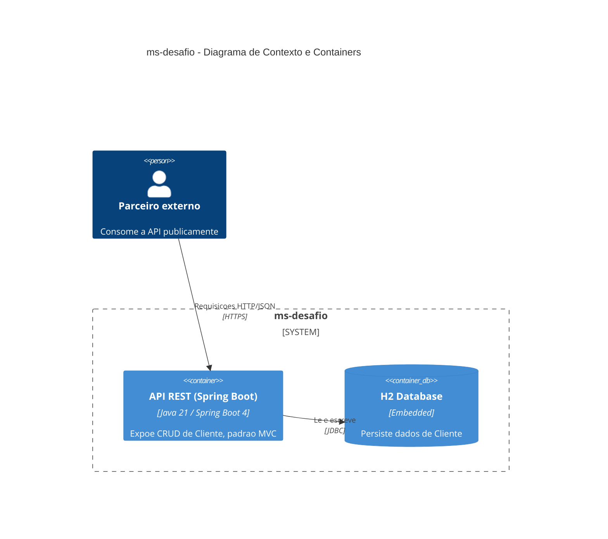
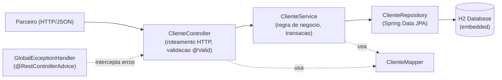

# Arquitetura — ms-desafio

## C4 — Contexto e Containers

## Camadas internas (MVC)

## Explicação das camadas

- **Controller**: recebe requisição HTTP, valida entrada (`@Valid`), delega ao Service, define status code de resposta. Não contém regra de negócio.
- **Service**: contém a regra de negócio (verificação de email duplicado, existência de registro) e controla a transação. Único ponto que conhece tanto DTO quanto Entity.
- **Repository**: interface Spring Data JPA, acesso a dado, sem lógica.
- **Model (Entity)**: representa o schema persistido na tabela `cliente`.
- **DTO**: representa o contrato exposto na API (`ClienteRequestDTO` para entrada, `ClienteResponseDTO` para saída), independente do schema interno.
- **Mapper**: converte Entity↔DTO, evitando que Controller/Service repitam lógica de tradução.
- **GlobalExceptionHandler**: centraliza tratamento de erro, traduz exceções de domínio em respostas HTTP padronizadas (`ProblemDetail`, RFC 9457).

> Este diagrama é escrito em Mermaid. Para abrir/editar no draw.io: **Extras → Edit Diagram**, cole o bloco Mermaid correspondente, e o draw.io renderiza o diagrama nativamente.
