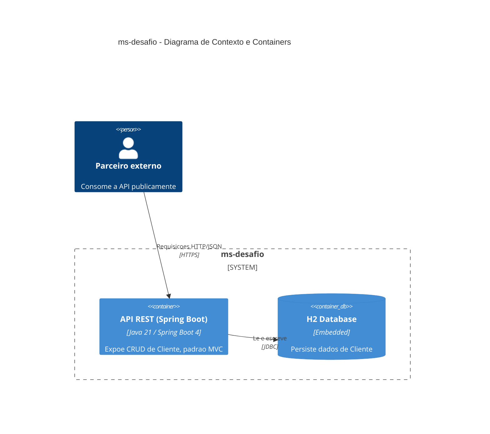
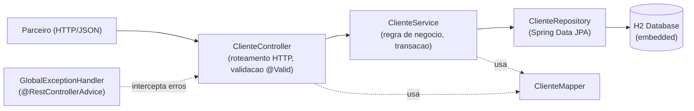

# ms-desafio Implementation Plan

> **For agentic workers:** REQUIRED SUB-SKILL: Use superpowers:subagent-driven-development (recommended) or superpowers:executing-plans to implement this plan task-by-task. Steps use checkbox (`- [ ]`) syntax for tracking.

**Goal:** Build a Spring Boot REST API (`ms-desafio`) exposing CRUD + count/findAll/findById/findByName on a `Cliente` entity, with H2 embedded persistence, OpenAPI docs, and an MVC-layered architecture (Controller → Service → Repository → Entity, with DTOs for the API contract).

**Architecture:** Classic layered MVC. Controllers handle HTTP only, Services hold business rules, Repositories handle persistence via Spring Data JPA, DTOs decouple the API contract from the JPA entity, a manual `ClienteMapper` converts between them, and a `@RestControllerAdvice` centralizes error handling as RFC 9457 `ProblemDetail` responses.

**Tech Stack:** Java 21, Spring Boot 4.0.0, Maven, Spring Web, Spring Data JPA, H2 (embedded), Jakarta Validation, springdoc-openapi-starter-webmvc-ui 3.0.3, Lombok, JUnit 5, Mockito.

**Spec:** `docs/superpowers/specs/2026-06-20-ms-desafio-design.md`

---

## File Structure

```
pom.xml
src/main/resources/application.yml
src/main/resources/data.sql
src/main/java/br/com/pelorca/desafio/msdesafio/
├── MsDesafioApplication.java
├── model/Cliente.java
├── repository/ClienteRepository.java
├── dto/ClienteRequestDTO.java
├── dto/ClienteResponseDTO.java
├── mapper/ClienteMapper.java
├── exception/ClienteNotFoundException.java
├── exception/EmailDuplicadoException.java
├── exception/GlobalExceptionHandler.java
├── service/ClienteService.java
├── controller/ClienteController.java
└── config/OpenApiConfig.java
src/test/java/br/com/pelorca/desafio/msdesafio/
├── repository/ClienteRepositoryTest.java
├── mapper/ClienteMapperTest.java
├── service/ClienteServiceTest.java
└── controller/ClienteControllerTest.java
docs/architecture.md
README.md
```

---

### Task 1: Project Scaffold

**Files:**
- Create: `pom.xml`
- Create: `src/main/resources/application.yml`
- Create: `src/main/resources/data.sql`
- Create: `src/main/java/br/com/pelorca/desafio/msdesafio/MsDesafioApplication.java`

- [ ] **Step 1: Create `pom.xml`**

```xml
<?xml version="1.0" encoding="UTF-8"?>
<project xmlns="http://maven.apache.org/POM/4.0.0"
         xmlns:xsi="http://www.w3.org/2001/XMLSchema-instance"
         xsi:schemaLocation="http://maven.apache.org/POM/4.0.0 https://maven.apache.org/xsd/maven-4.0.0.xsd">
    <modelVersion>4.0.0</modelVersion>

    <parent>
        <groupId>org.springframework.boot</groupId>
        <artifactId>spring-boot-starter-parent</artifactId>
        <version>4.0.0</version>
        <relativePath/>
    </parent>

    <groupId>br.com.pelorca.desafio</groupId>
    <artifactId>ms-desafio</artifactId>
    <version>0.0.1-SNAPSHOT</version>
    <name>ms-desafio</name>
    <description>Desafio Final - Bootcamp Arquiteto de Software</description>

    <properties>
        <java.version>21</java.version>
    </properties>

    <dependencies>
        <dependency>
            <groupId>org.springframework.boot</groupId>
            <artifactId>spring-boot-starter-web</artifactId>
        </dependency>
        <dependency>
            <groupId>org.springframework.boot</groupId>
            <artifactId>spring-boot-starter-data-jpa</artifactId>
        </dependency>
        <dependency>
            <groupId>org.springframework.boot</groupId>
            <artifactId>spring-boot-starter-validation</artifactId>
        </dependency>
        <dependency>
            <groupId>com.h2database</groupId>
            <artifactId>h2</artifactId>
            <scope>runtime</scope>
        </dependency>
        <dependency>
            <groupId>org.projectlombok</groupId>
            <artifactId>lombok</artifactId>
            <optional>true</optional>
        </dependency>
        <dependency>
            <groupId>org.springdoc</groupId>
            <artifactId>springdoc-openapi-starter-webmvc-ui</artifactId>
            <version>3.0.3</version>
        </dependency>
        <dependency>
            <groupId>org.springframework.boot</groupId>
            <artifactId>spring-boot-starter-test</artifactId>
            <scope>test</scope>
        </dependency>
    </dependencies>

    <build>
        <plugins>
            <plugin>
                <groupId>org.springframework.boot</groupId>
                <artifactId>spring-boot-maven-plugin</artifactId>
                <configuration>
                    <excludes>
                        <exclude>
                            <groupId>org.projectlombok</groupId>
                            <artifactId>lombok</artifactId>
                        </exclude>
                    </excludes>
                </configuration>
            </plugin>
        </plugins>
    </build>
</project>
```

- [ ] **Step 2: Create `src/main/resources/application.yml`**

```yaml
server:
  port: 8080

spring:
  application:
    name: ms-desafio
  datasource:
    url: jdbc:h2:mem:msdesafio
    driver-class-name: org.h2.Driver
    username: sa
    password:
  jpa:
    hibernate:
      ddl-auto: create-drop
    show-sql: true
  h2:
    console:
      enabled: true
      path: /h2-console
  sql:
    init:
      mode: always

springdoc:
  swagger-ui:
    path: /swagger-ui.html
```

- [ ] **Step 3: Create `src/main/resources/data.sql`**

```sql
INSERT INTO cliente (nome, email, telefone, endereco) VALUES
('Ana Souza', 'ana.souza@example.com', '11999990001', 'Rua A, 100, Sao Paulo, SP'),
('Bruno Lima', 'bruno.lima@example.com', '21999990002', 'Rua B, 200, Rio de Janeiro, RJ'),
('Carla Dias', 'carla.dias@example.com', '31999990003', 'Rua C, 300, Belo Horizonte, MG');
```

- [ ] **Step 4: Create `src/main/java/br/com/pelorca/desafio/msdesafio/MsDesafioApplication.java`**

```java
package br.com.pelorca.desafio.msdesafio;

import org.springframework.boot.SpringApplication;
import org.springframework.boot.autoconfigure.SpringBootApplication;

@SpringBootApplication
public class MsDesafioApplication {

    public static void main(String[] args) {
        SpringApplication.run(MsDesafioApplication.class, args);
    }
}
```

- [ ] **Step 5: Verify the project compiles**

Run: `mvn -q compile`
Expected: build succeeds, no errors (there's no `Cliente` table yet, so `data.sql` will fail at runtime — that's expected until Task 2; compile only checks Java source, not DB schema).

- [ ] **Step 6: Commit**

```bash
git add pom.xml src/main/resources/application.yml src/main/resources/data.sql src/main/java/br/com/pelorca/desafio/msdesafio/MsDesafioApplication.java
git commit -m "chore: scaffold ms-desafio Spring Boot project"
```

---

### Task 2: Cliente Entity (Model)

**Files:**
- Create: `src/main/java/br/com/pelorca/desafio/msdesafio/model/Cliente.java`

- [ ] **Step 1: Create the entity**

```java
package br.com.pelorca.desafio.msdesafio.model;

import jakarta.persistence.Column;
import jakarta.persistence.Entity;
import jakarta.persistence.GeneratedValue;
import jakarta.persistence.GenerationType;
import jakarta.persistence.Id;
import jakarta.persistence.Table;
import lombok.AllArgsConstructor;
import lombok.Builder;
import lombok.Data;
import lombok.NoArgsConstructor;

@Entity
@Table(name = "cliente")
@Data
@NoArgsConstructor
@AllArgsConstructor
@Builder
public class Cliente {

    @Id
    @GeneratedValue(strategy = GenerationType.IDENTITY)
    private Long id;

    @Column(nullable = false, length = 120)
    private String nome;

    @Column(nullable = false, unique = true)
    private String email;

    @Column(length = 20)
    private String telefone;

    @Column(length = 200)
    private String endereco;
}
```

- [ ] **Step 2: Verify the project compiles**

Run: `mvn -q compile`
Expected: build succeeds.

- [ ] **Step 3: Commit**

```bash
git add src/main/java/br/com/pelorca/desafio/msdesafio/model/Cliente.java
git commit -m "feat: add Cliente JPA entity"
```

---

### Task 3: ClienteRepository

**Files:**
- Create: `src/main/java/br/com/pelorca/desafio/msdesafio/repository/ClienteRepository.java`
- Test: `src/test/java/br/com/pelorca/desafio/msdesafio/repository/ClienteRepositoryTest.java`

- [ ] **Step 1: Write the failing test**

```java
package br.com.pelorca.desafio.msdesafio.repository;

import br.com.pelorca.desafio.msdesafio.model.Cliente;
import org.junit.jupiter.api.Test;
import org.springframework.beans.factory.annotation.Autowired;
import org.springframework.boot.test.autoconfigure.orm.jpa.DataJpaTest;

import java.util.List;

import static org.assertj.core.api.Assertions.assertThat;

@DataJpaTest
class ClienteRepositoryTest {

    @Autowired
    private ClienteRepository clienteRepository;

    @Test
    void deveEncontrarClientesPorNomeIgnorandoCaixa() {
        clienteRepository.save(Cliente.builder().nome("Ana Souza").email("ana@example.com").build());
        clienteRepository.save(Cliente.builder().nome("Ana Paula").email("anapaula@example.com").build());
        clienteRepository.save(Cliente.builder().nome("Bruno Lima").email("bruno@example.com").build());

        List<Cliente> encontrados = clienteRepository.findByNomeContainingIgnoreCase("ana");

        assertThat(encontrados).hasSize(2);
        assertThat(encontrados).extracting(Cliente::getNome)
                .containsExactlyInAnyOrder("Ana Souza", "Ana Paula");
    }

    @Test
    void deveVerificarExistenciaPorEmail() {
        clienteRepository.save(Cliente.builder().nome("Ana Souza").email("ana@example.com").build());

        assertThat(clienteRepository.existsByEmail("ana@example.com")).isTrue();
        assertThat(clienteRepository.existsByEmail("inexistente@example.com")).isFalse();
    }

    @Test
    void deveVerificarExistenciaPorEmailExcluindoId() {
        Cliente salvo = clienteRepository.save(Cliente.builder().nome("Ana Souza").email("ana@example.com").build());

        assertThat(clienteRepository.existsByEmailAndIdNot("ana@example.com", salvo.getId())).isFalse();
        assertThat(clienteRepository.existsByEmailAndIdNot("ana@example.com", -1L)).isTrue();
    }
}
```

- [ ] **Step 2: Run test to verify it fails**

Run: `mvn test -Dtest=ClienteRepositoryTest`
Expected: FAIL — compile error, `ClienteRepository` does not exist.

- [ ] **Step 3: Write minimal implementation**

```java
package br.com.pelorca.desafio.msdesafio.repository;

import br.com.pelorca.desafio.msdesafio.model.Cliente;
import org.springframework.data.jpa.repository.JpaRepository;
import org.springframework.stereotype.Repository;

import java.util.List;

@Repository
public interface ClienteRepository extends JpaRepository<Cliente, Long> {

    List<Cliente> findByNomeContainingIgnoreCase(String nome);

    boolean existsByEmail(String email);

    boolean existsByEmailAndIdNot(String email, Long id);
}
```

- [ ] **Step 4: Run test to verify it passes**

Run: `mvn test -Dtest=ClienteRepositoryTest`
Expected: PASS (3 tests).

- [ ] **Step 5: Commit**

```bash
git add src/main/java/br/com/pelorca/desafio/msdesafio/repository/ClienteRepository.java src/test/java/br/com/pelorca/desafio/msdesafio/repository/ClienteRepositoryTest.java
git commit -m "feat: add ClienteRepository with name search and email existence queries"
```

---

### Task 4: DTOs

**Files:**
- Create: `src/main/java/br/com/pelorca/desafio/msdesafio/dto/ClienteRequestDTO.java`
- Create: `src/main/java/br/com/pelorca/desafio/msdesafio/dto/ClienteResponseDTO.java`

- [ ] **Step 1: Create `ClienteRequestDTO`**

```java
package br.com.pelorca.desafio.msdesafio.dto;

import jakarta.validation.constraints.Email;
import jakarta.validation.constraints.NotBlank;
import jakarta.validation.constraints.Size;

public record ClienteRequestDTO(
        @NotBlank(message = "nome é obrigatório")
        @Size(max = 120, message = "nome deve ter no máximo 120 caracteres")
        String nome,

        @NotBlank(message = "email é obrigatório")
        @Email(message = "email inválido")
        String email,

        @Size(max = 20, message = "telefone deve ter no máximo 20 caracteres")
        String telefone,

        @Size(max = 200, message = "endereco deve ter no máximo 200 caracteres")
        String endereco
) {
}
```

- [ ] **Step 2: Create `ClienteResponseDTO`**

```java
package br.com.pelorca.desafio.msdesafio.dto;

public record ClienteResponseDTO(
        Long id,
        String nome,
        String email,
        String telefone,
        String endereco
) {
}
```

- [ ] **Step 3: Verify the project compiles**

Run: `mvn -q compile`
Expected: build succeeds.

- [ ] **Step 4: Commit**

```bash
git add src/main/java/br/com/pelorca/desafio/msdesafio/dto/ClienteRequestDTO.java src/main/java/br/com/pelorca/desafio/msdesafio/dto/ClienteResponseDTO.java
git commit -m "feat: add Cliente request and response DTOs with bean validation"
```

---

### Task 5: ClienteMapper

**Files:**
- Create: `src/main/java/br/com/pelorca/desafio/msdesafio/mapper/ClienteMapper.java`
- Test: `src/test/java/br/com/pelorca/desafio/msdesafio/mapper/ClienteMapperTest.java`

- [ ] **Step 1: Write the failing test**

```java
package br.com.pelorca.desafio.msdesafio.mapper;

import br.com.pelorca.desafio.msdesafio.dto.ClienteRequestDTO;
import br.com.pelorca.desafio.msdesafio.dto.ClienteResponseDTO;
import br.com.pelorca.desafio.msdesafio.model.Cliente;
import org.junit.jupiter.api.Test;

import java.util.List;

import static org.assertj.core.api.Assertions.assertThat;

class ClienteMapperTest {

    @Test
    void deveConverterRequestDtoParaEntity() {
        ClienteRequestDTO dto = new ClienteRequestDTO("Ana Souza", "ana@example.com", "11999990001", "Rua A, 100");

        Cliente cliente = ClienteMapper.toEntity(dto);

        assertThat(cliente.getId()).isNull();
        assertThat(cliente.getNome()).isEqualTo("Ana Souza");
        assertThat(cliente.getEmail()).isEqualTo("ana@example.com");
        assertThat(cliente.getTelefone()).isEqualTo("11999990001");
        assertThat(cliente.getEndereco()).isEqualTo("Rua A, 100");
    }

    @Test
    void deveConverterEntityParaResponseDto() {
        Cliente cliente = Cliente.builder()
                .id(1L).nome("Ana Souza").email("ana@example.com")
                .telefone("11999990001").endereco("Rua A, 100").build();

        ClienteResponseDTO dto = ClienteMapper.toResponseDTO(cliente);

        assertThat(dto.id()).isEqualTo(1L);
        assertThat(dto.nome()).isEqualTo("Ana Souza");
        assertThat(dto.email()).isEqualTo("ana@example.com");
        assertThat(dto.telefone()).isEqualTo("11999990001");
        assertThat(dto.endereco()).isEqualTo("Rua A, 100");
    }

    @Test
    void deveConverterListaDeEntitiesParaListaDeResponseDto() {
        Cliente c1 = Cliente.builder().id(1L).nome("Ana").email("ana@example.com").build();
        Cliente c2 = Cliente.builder().id(2L).nome("Bruno").email("bruno@example.com").build();

        List<ClienteResponseDTO> dtos = ClienteMapper.toResponseDTOList(List.of(c1, c2));

        assertThat(dtos).hasSize(2);
        assertThat(dtos).extracting(ClienteResponseDTO::nome).containsExactly("Ana", "Bruno");
    }

    @Test
    void deveAtualizarEntityExistenteComDadosDoRequestDto() {
        Cliente cliente = Cliente.builder().id(1L).nome("Ana Souza").email("ana@example.com")
                .telefone("11999990001").endereco("Rua A, 100").build();
        ClienteRequestDTO dto = new ClienteRequestDTO("Ana S. Lima", "ana.lima@example.com", "11999990099", "Rua Z, 999");

        ClienteMapper.updateEntityFromDto(cliente, dto);

        assertThat(cliente.getId()).isEqualTo(1L);
        assertThat(cliente.getNome()).isEqualTo("Ana S. Lima");
        assertThat(cliente.getEmail()).isEqualTo("ana.lima@example.com");
        assertThat(cliente.getTelefone()).isEqualTo("11999990099");
        assertThat(cliente.getEndereco()).isEqualTo("Rua Z, 999");
    }
}
```

- [ ] **Step 2: Run test to verify it fails**

Run: `mvn test -Dtest=ClienteMapperTest`
Expected: FAIL — compile error, `ClienteMapper` does not exist.

- [ ] **Step 3: Write minimal implementation**

```java
package br.com.pelorca.desafio.msdesafio.mapper;

import br.com.pelorca.desafio.msdesafio.dto.ClienteRequestDTO;
import br.com.pelorca.desafio.msdesafio.dto.ClienteResponseDTO;
import br.com.pelorca.desafio.msdesafio.model.Cliente;

import java.util.List;

public final class ClienteMapper {

    private ClienteMapper() {
    }

    public static Cliente toEntity(ClienteRequestDTO dto) {
        return Cliente.builder()
                .nome(dto.nome())
                .email(dto.email())
                .telefone(dto.telefone())
                .endereco(dto.endereco())
                .build();
    }

    public static ClienteResponseDTO toResponseDTO(Cliente cliente) {
        return new ClienteResponseDTO(
                cliente.getId(),
                cliente.getNome(),
                cliente.getEmail(),
                cliente.getTelefone(),
                cliente.getEndereco()
        );
    }

    public static List<ClienteResponseDTO> toResponseDTOList(List<Cliente> clientes) {
        return clientes.stream().map(ClienteMapper::toResponseDTO).toList();
    }

    public static void updateEntityFromDto(Cliente cliente, ClienteRequestDTO dto) {
        cliente.setNome(dto.nome());
        cliente.setEmail(dto.email());
        cliente.setTelefone(dto.telefone());
        cliente.setEndereco(dto.endereco());
    }
}
```

- [ ] **Step 4: Run test to verify it passes**

Run: `mvn test -Dtest=ClienteMapperTest`
Expected: PASS (4 tests).

- [ ] **Step 5: Commit**

```bash
git add src/main/java/br/com/pelorca/desafio/msdesafio/mapper/ClienteMapper.java src/test/java/br/com/pelorca/desafio/msdesafio/mapper/ClienteMapperTest.java
git commit -m "feat: add ClienteMapper for Entity-DTO conversion"
```

---

### Task 6: Domain Exceptions

**Files:**
- Create: `src/main/java/br/com/pelorca/desafio/msdesafio/exception/ClienteNotFoundException.java`
- Create: `src/main/java/br/com/pelorca/desafio/msdesafio/exception/EmailDuplicadoException.java`

- [ ] **Step 1: Create `ClienteNotFoundException`**

```java
package br.com.pelorca.desafio.msdesafio.exception;

public class ClienteNotFoundException extends RuntimeException {

    public ClienteNotFoundException(Long id) {
        super("Cliente não encontrado com id: " + id);
    }
}
```

- [ ] **Step 2: Create `EmailDuplicadoException`**

```java
package br.com.pelorca.desafio.msdesafio.exception;

public class EmailDuplicadoException extends RuntimeException {

    public EmailDuplicadoException(String email) {
        super("Já existe um cliente cadastrado com o email: " + email);
    }
}
```

- [ ] **Step 3: Verify the project compiles**

Run: `mvn -q compile`
Expected: build succeeds.

- [ ] **Step 4: Commit**

```bash
git add src/main/java/br/com/pelorca/desafio/msdesafio/exception/ClienteNotFoundException.java src/main/java/br/com/pelorca/desafio/msdesafio/exception/EmailDuplicadoException.java
git commit -m "feat: add domain exceptions for not-found and duplicate-email cases"
```

---

### Task 7: GlobalExceptionHandler

**Files:**
- Create: `src/main/java/br/com/pelorca/desafio/msdesafio/exception/GlobalExceptionHandler.java`

(Tested indirectly via `ClienteControllerTest` in Task 9 — exception mapping is only observable through the HTTP layer.)

- [ ] **Step 1: Create the handler**

```java
package br.com.pelorca.desafio.msdesafio.exception;

import org.springframework.http.HttpStatus;
import org.springframework.http.ProblemDetail;
import org.springframework.validation.FieldError;
import org.springframework.web.bind.MethodArgumentNotValidException;
import org.springframework.web.bind.annotation.ExceptionHandler;
import org.springframework.web.bind.annotation.RestControllerAdvice;

import java.util.LinkedHashMap;
import java.util.Map;

@RestControllerAdvice
public class GlobalExceptionHandler {

    @ExceptionHandler(ClienteNotFoundException.class)
    public ProblemDetail handleClienteNotFound(ClienteNotFoundException ex) {
        return ProblemDetail.forStatusAndDetail(HttpStatus.NOT_FOUND, ex.getMessage());
    }

    @ExceptionHandler(EmailDuplicadoException.class)
    public ProblemDetail handleEmailDuplicado(EmailDuplicadoException ex) {
        return ProblemDetail.forStatusAndDetail(HttpStatus.CONFLICT, ex.getMessage());
    }

    @ExceptionHandler(MethodArgumentNotValidException.class)
    public ProblemDetail handleValidationError(MethodArgumentNotValidException ex) {
        Map<String, String> erros = new LinkedHashMap<>();
        for (FieldError erro : ex.getBindingResult().getFieldErrors()) {
            erros.put(erro.getField(), erro.getDefaultMessage());
        }
        ProblemDetail problemDetail = ProblemDetail.forStatusAndDetail(
                HttpStatus.BAD_REQUEST, "Erro de validação nos dados enviados");
        problemDetail.setProperty("errors", erros);
        return problemDetail;
    }
}
```

- [ ] **Step 2: Verify the project compiles**

Run: `mvn -q compile`
Expected: build succeeds.

- [ ] **Step 3: Commit**

```bash
git add src/main/java/br/com/pelorca/desafio/msdesafio/exception/GlobalExceptionHandler.java
git commit -m "feat: add global exception handler returning RFC 9457 ProblemDetail"
```

---

### Task 8: ClienteService

**Files:**
- Create: `src/main/java/br/com/pelorca/desafio/msdesafio/service/ClienteService.java`
- Test: `src/test/java/br/com/pelorca/desafio/msdesafio/service/ClienteServiceTest.java`

- [ ] **Step 1: Write the failing test**

```java
package br.com.pelorca.desafio.msdesafio.service;

import br.com.pelorca.desafio.msdesafio.dto.ClienteRequestDTO;
import br.com.pelorca.desafio.msdesafio.dto.ClienteResponseDTO;
import br.com.pelorca.desafio.msdesafio.exception.ClienteNotFoundException;
import br.com.pelorca.desafio.msdesafio.exception.EmailDuplicadoException;
import br.com.pelorca.desafio.msdesafio.model.Cliente;
import br.com.pelorca.desafio.msdesafio.repository.ClienteRepository;
import org.junit.jupiter.api.Test;
import org.junit.jupiter.api.extension.ExtendWith;
import org.mockito.InjectMocks;
import org.mockito.Mock;
import org.mockito.junit.jupiter.MockitoExtension;

import java.util.List;
import java.util.Optional;

import static org.assertj.core.api.Assertions.assertThat;
import static org.assertj.core.api.Assertions.assertThatThrownBy;
import static org.mockito.ArgumentMatchers.any;
import static org.mockito.ArgumentMatchers.anyLong;
import static org.mockito.ArgumentMatchers.eq;
import static org.mockito.Mockito.never;
import static org.mockito.Mockito.times;
import static org.mockito.Mockito.verify;
import static org.mockito.Mockito.when;

@ExtendWith(MockitoExtension.class)
class ClienteServiceTest {

    @Mock
    private ClienteRepository clienteRepository;

    @InjectMocks
    private ClienteService clienteService;

    private Cliente clienteExistente() {
        return Cliente.builder().id(1L).nome("Ana Souza").email("ana@example.com")
                .telefone("11999990001").endereco("Rua A, 100").build();
    }

    @Test
    void deveListarTodos() {
        when(clienteRepository.findAll()).thenReturn(List.of(clienteExistente()));

        List<ClienteResponseDTO> resultado = clienteService.listarTodos();

        assertThat(resultado).hasSize(1);
        assertThat(resultado.get(0).nome()).isEqualTo("Ana Souza");
    }

    @Test
    void deveBuscarPorIdQuandoExiste() {
        when(clienteRepository.findById(1L)).thenReturn(Optional.of(clienteExistente()));

        ClienteResponseDTO resultado = clienteService.buscarPorId(1L);

        assertThat(resultado.id()).isEqualTo(1L);
    }

    @Test
    void deveLancarExceptionQuandoBuscarPorIdInexistente() {
        when(clienteRepository.findById(99L)).thenReturn(Optional.empty());

        assertThatThrownBy(() -> clienteService.buscarPorId(99L))
                .isInstanceOf(ClienteNotFoundException.class);
    }

    @Test
    void deveBuscarPorNome() {
        when(clienteRepository.findByNomeContainingIgnoreCase("Ana")).thenReturn(List.of(clienteExistente()));

        List<ClienteResponseDTO> resultado = clienteService.buscarPorNome("Ana");

        assertThat(resultado).hasSize(1);
    }

    @Test
    void deveContar() {
        when(clienteRepository.count()).thenReturn(5L);

        assertThat(clienteService.contar()).isEqualTo(5L);
    }

    @Test
    void deveCriarClienteQuandoEmailNaoExiste() {
        ClienteRequestDTO dto = new ClienteRequestDTO("Ana Souza", "ana@example.com", "11999990001", "Rua A, 100");
        when(clienteRepository.existsByEmail("ana@example.com")).thenReturn(false);
        when(clienteRepository.save(any(Cliente.class))).thenReturn(clienteExistente());

        ClienteResponseDTO resultado = clienteService.criar(dto);

        assertThat(resultado.email()).isEqualTo("ana@example.com");
        verify(clienteRepository, times(1)).save(any(Cliente.class));
    }

    @Test
    void deveLancarExceptionAoCriarComEmailDuplicado() {
        ClienteRequestDTO dto = new ClienteRequestDTO("Ana Souza", "ana@example.com", "11999990001", "Rua A, 100");
        when(clienteRepository.existsByEmail("ana@example.com")).thenReturn(true);

        assertThatThrownBy(() -> clienteService.criar(dto))
                .isInstanceOf(EmailDuplicadoException.class);
        verify(clienteRepository, never()).save(any(Cliente.class));
    }

    @Test
    void deveAtualizarClienteQuandoExisteEEmailDisponivel() {
        ClienteRequestDTO dto = new ClienteRequestDTO("Ana S. Lima", "ana.lima@example.com", "11999990099", "Rua Z, 999");
        Cliente existente = clienteExistente();
        when(clienteRepository.findById(1L)).thenReturn(Optional.of(existente));
        when(clienteRepository.existsByEmailAndIdNot("ana.lima@example.com", 1L)).thenReturn(false);
        when(clienteRepository.save(any(Cliente.class))).thenReturn(existente);

        ClienteResponseDTO resultado = clienteService.atualizar(1L, dto);

        assertThat(resultado).isNotNull();
        verify(clienteRepository, times(1)).save(existente);
    }

    @Test
    void deveLancarExceptionAoAtualizarClienteInexistente() {
        ClienteRequestDTO dto = new ClienteRequestDTO("Ana S. Lima", "ana.lima@example.com", "11999990099", "Rua Z, 999");
        when(clienteRepository.findById(99L)).thenReturn(Optional.empty());

        assertThatThrownBy(() -> clienteService.atualizar(99L, dto))
                .isInstanceOf(ClienteNotFoundException.class);
    }

    @Test
    void deveLancarExceptionAoAtualizarComEmailDeOutroCliente() {
        ClienteRequestDTO dto = new ClienteRequestDTO("Ana S. Lima", "outro@example.com", "11999990099", "Rua Z, 999");
        when(clienteRepository.findById(1L)).thenReturn(Optional.of(clienteExistente()));
        when(clienteRepository.existsByEmailAndIdNot("outro@example.com", 1L)).thenReturn(true);

        assertThatThrownBy(() -> clienteService.atualizar(1L, dto))
                .isInstanceOf(EmailDuplicadoException.class);
    }

    @Test
    void deveDeletarClienteQuandoExiste() {
        when(clienteRepository.existsById(1L)).thenReturn(true);

        clienteService.deletar(1L);

        verify(clienteRepository, times(1)).deleteById(1L);
    }

    @Test
    void deveLancarExceptionAoDeletarClienteInexistente() {
        when(clienteRepository.existsById(99L)).thenReturn(false);

        assertThatThrownBy(() -> clienteService.deletar(99L))
                .isInstanceOf(ClienteNotFoundException.class);
        verify(clienteRepository, never()).deleteById(anyLong());
    }
}
```

- [ ] **Step 2: Run test to verify it fails**

Run: `mvn test -Dtest=ClienteServiceTest`
Expected: FAIL — compile error, `ClienteService` does not exist.

- [ ] **Step 3: Write minimal implementation**

```java
package br.com.pelorca.desafio.msdesafio.service;

import br.com.pelorca.desafio.msdesafio.dto.ClienteRequestDTO;
import br.com.pelorca.desafio.msdesafio.dto.ClienteResponseDTO;
import br.com.pelorca.desafio.msdesafio.exception.ClienteNotFoundException;
import br.com.pelorca.desafio.msdesafio.exception.EmailDuplicadoException;
import br.com.pelorca.desafio.msdesafio.mapper.ClienteMapper;
import br.com.pelorca.desafio.msdesafio.model.Cliente;
import br.com.pelorca.desafio.msdesafio.repository.ClienteRepository;
import lombok.RequiredArgsConstructor;
import org.springframework.stereotype.Service;
import org.springframework.transaction.annotation.Transactional;

import java.util.List;

@Service
@RequiredArgsConstructor
@Transactional
public class ClienteService {

    private final ClienteRepository clienteRepository;

    public List<ClienteResponseDTO> listarTodos() {
        return ClienteMapper.toResponseDTOList(clienteRepository.findAll());
    }

    public ClienteResponseDTO buscarPorId(Long id) {
        Cliente cliente = buscarEntityPorId(id);
        return ClienteMapper.toResponseDTO(cliente);
    }

    public List<ClienteResponseDTO> buscarPorNome(String nome) {
        return ClienteMapper.toResponseDTOList(clienteRepository.findByNomeContainingIgnoreCase(nome));
    }

    public long contar() {
        return clienteRepository.count();
    }

    public ClienteResponseDTO criar(ClienteRequestDTO dto) {
        if (clienteRepository.existsByEmail(dto.email())) {
            throw new EmailDuplicadoException(dto.email());
        }
        Cliente salvo = clienteRepository.save(ClienteMapper.toEntity(dto));
        return ClienteMapper.toResponseDTO(salvo);
    }

    public ClienteResponseDTO atualizar(Long id, ClienteRequestDTO dto) {
        Cliente cliente = buscarEntityPorId(id);
        if (clienteRepository.existsByEmailAndIdNot(dto.email(), id)) {
            throw new EmailDuplicadoException(dto.email());
        }
        ClienteMapper.updateEntityFromDto(cliente, dto);
        Cliente atualizado = clienteRepository.save(cliente);
        return ClienteMapper.toResponseDTO(atualizado);
    }

    public void deletar(Long id) {
        if (!clienteRepository.existsById(id)) {
            throw new ClienteNotFoundException(id);
        }
        clienteRepository.deleteById(id);
    }

    private Cliente buscarEntityPorId(Long id) {
        return clienteRepository.findById(id)
                .orElseThrow(() -> new ClienteNotFoundException(id));
    }
}
```

- [ ] **Step 4: Run test to verify it passes**

Run: `mvn test -Dtest=ClienteServiceTest`
Expected: PASS (12 tests).

- [ ] **Step 5: Commit**

```bash
git add src/main/java/br/com/pelorca/desafio/msdesafio/service/ClienteService.java src/test/java/br/com/pelorca/desafio/msdesafio/service/ClienteServiceTest.java
git commit -m "feat: add ClienteService with CRUD, count and name search business rules"
```

---

### Task 9: ClienteController

**Files:**
- Create: `src/main/java/br/com/pelorca/desafio/msdesafio/controller/ClienteController.java`
- Test: `src/test/java/br/com/pelorca/desafio/msdesafio/controller/ClienteControllerTest.java`

- [ ] **Step 1: Write the failing test**

```java
package br.com.pelorca.desafio.msdesafio.controller;

import br.com.pelorca.desafio.msdesafio.dto.ClienteRequestDTO;
import br.com.pelorca.desafio.msdesafio.dto.ClienteResponseDTO;
import br.com.pelorca.desafio.msdesafio.exception.ClienteNotFoundException;
import br.com.pelorca.desafio.msdesafio.exception.EmailDuplicadoException;
import br.com.pelorca.desafio.msdesafio.service.ClienteService;
import com.fasterxml.jackson.databind.ObjectMapper;
import org.junit.jupiter.api.Test;
import org.springframework.beans.factory.annotation.Autowired;
import org.springframework.boot.test.autoconfigure.web.servlet.AutoConfigureMockMvc;
import org.springframework.boot.test.context.SpringBootTest;
import org.springframework.http.MediaType;
import org.springframework.test.context.bean.override.mockito.MockitoBean;
import org.springframework.test.web.servlet.MockMvc;

import java.util.List;

import static org.mockito.ArgumentMatchers.any;
import static org.mockito.ArgumentMatchers.anyLong;
import static org.mockito.ArgumentMatchers.eq;
import static org.mockito.Mockito.doThrow;
import static org.mockito.Mockito.verify;
import static org.mockito.Mockito.when;
import static org.springframework.test.web.servlet.request.MockMvcRequestBuilders.delete;
import static org.springframework.test.web.servlet.request.MockMvcRequestBuilders.get;
import static org.springframework.test.web.servlet.request.MockMvcRequestBuilders.post;
import static org.springframework.test.web.servlet.request.MockMvcRequestBuilders.put;
import static org.springframework.test.web.servlet.result.MockMvcResultMatchers.jsonPath;
import static org.springframework.test.web.servlet.result.MockMvcResultMatchers.status;

@SpringBootTest
@AutoConfigureMockMvc
class ClienteControllerTest {

    @Autowired
    private MockMvc mockMvc;

    @Autowired
    private ObjectMapper objectMapper;

    @MockitoBean
    private ClienteService clienteService;

    private ClienteResponseDTO clienteResponse() {
        return new ClienteResponseDTO(1L, "Ana Souza", "ana@example.com", "11999990001", "Rua A, 100");
    }

    @Test
    void deveListarTodosClientes() throws Exception {
        when(clienteService.listarTodos()).thenReturn(List.of(clienteResponse()));

        mockMvc.perform(get("/api/clientes"))
                .andExpect(status().isOk())
                .andExpect(jsonPath("$[0].nome").value("Ana Souza"));
    }

    @Test
    void deveBuscarClientePorId() throws Exception {
        when(clienteService.buscarPorId(1L)).thenReturn(clienteResponse());

        mockMvc.perform(get("/api/clientes/1"))
                .andExpect(status().isOk())
                .andExpect(jsonPath("$.email").value("ana@example.com"));
    }

    @Test
    void deveRetornar404QuandoClienteNaoEncontrado() throws Exception {
        when(clienteService.buscarPorId(99L)).thenThrow(new ClienteNotFoundException(99L));

        mockMvc.perform(get("/api/clientes/99"))
                .andExpect(status().isNotFound());
    }

    @Test
    void deveBuscarClientesPorNome() throws Exception {
        when(clienteService.buscarPorNome("Ana")).thenReturn(List.of(clienteResponse()));

        mockMvc.perform(get("/api/clientes/nome/Ana"))
                .andExpect(status().isOk())
                .andExpect(jsonPath("$[0].nome").value("Ana Souza"));
    }

    @Test
    void deveContarClientes() throws Exception {
        when(clienteService.contar()).thenReturn(3L);

        mockMvc.perform(get("/api/clientes/contar"))
                .andExpect(status().isOk())
                .andExpect(jsonPath("$").value(3));
    }

    @Test
    void deveCriarCliente() throws Exception {
        ClienteRequestDTO request = new ClienteRequestDTO("Ana Souza", "ana@example.com", "11999990001", "Rua A, 100");
        when(clienteService.criar(any(ClienteRequestDTO.class))).thenReturn(clienteResponse());

        mockMvc.perform(post("/api/clientes")
                        .contentType(MediaType.APPLICATION_JSON)
                        .content(objectMapper.writeValueAsString(request)))
                .andExpect(status().isCreated())
                .andExpect(jsonPath("$.id").value(1));
    }

    @Test
    void deveRetornar400QuandoCriarComDadosInvalidos() throws Exception {
        ClienteRequestDTO request = new ClienteRequestDTO("", "email-invalido", null, null);

        mockMvc.perform(post("/api/clientes")
                        .contentType(MediaType.APPLICATION_JSON)
                        .content(objectMapper.writeValueAsString(request)))
                .andExpect(status().isBadRequest());
    }

    @Test
    void deveRetornar409QuandoCriarComEmailDuplicado() throws Exception {
        ClienteRequestDTO request = new ClienteRequestDTO("Ana Souza", "ana@example.com", "11999990001", "Rua A, 100");
        when(clienteService.criar(any(ClienteRequestDTO.class)))
                .thenThrow(new EmailDuplicadoException("ana@example.com"));

        mockMvc.perform(post("/api/clientes")
                        .contentType(MediaType.APPLICATION_JSON)
                        .content(objectMapper.writeValueAsString(request)))
                .andExpect(status().isConflict());
    }

    @Test
    void deveAtualizarCliente() throws Exception {
        ClienteRequestDTO request = new ClienteRequestDTO("Ana S. Lima", "ana.lima@example.com", "11999990099", "Rua Z, 999");
        when(clienteService.atualizar(eq(1L), any(ClienteRequestDTO.class))).thenReturn(clienteResponse());

        mockMvc.perform(put("/api/clientes/1")
                        .contentType(MediaType.APPLICATION_JSON)
                        .content(objectMapper.writeValueAsString(request)))
                .andExpect(status().isOk());
    }

    @Test
    void deveRetornar404QuandoAtualizarClienteInexistente() throws Exception {
        ClienteRequestDTO request = new ClienteRequestDTO("Ana S. Lima", "ana.lima@example.com", "11999990099", "Rua Z, 999");
        when(clienteService.atualizar(eq(99L), any(ClienteRequestDTO.class)))
                .thenThrow(new ClienteNotFoundException(99L));

        mockMvc.perform(put("/api/clientes/99")
                        .contentType(MediaType.APPLICATION_JSON)
                        .content(objectMapper.writeValueAsString(request)))
                .andExpect(status().isNotFound());
    }

    @Test
    void deveDeletarCliente() throws Exception {
        mockMvc.perform(delete("/api/clientes/1"))
                .andExpect(status().isNoContent());

        verify(clienteService).deletar(1L);
    }

    @Test
    void deveRetornar404QuandoDeletarClienteInexistente() throws Exception {
        doThrow(new ClienteNotFoundException(99L)).when(clienteService).deletar(99L);

        mockMvc.perform(delete("/api/clientes/99"))
                .andExpect(status().isNotFound());
    }
}
```

- [ ] **Step 2: Run test to verify it fails**

Run: `mvn test -Dtest=ClienteControllerTest`
Expected: FAIL — compile error, `ClienteController` does not exist.

- [ ] **Step 3: Write minimal implementation**

```java
package br.com.pelorca.desafio.msdesafio.controller;

import br.com.pelorca.desafio.msdesafio.dto.ClienteRequestDTO;
import br.com.pelorca.desafio.msdesafio.dto.ClienteResponseDTO;
import br.com.pelorca.desafio.msdesafio.service.ClienteService;
import jakarta.validation.Valid;
import lombok.RequiredArgsConstructor;
import org.springframework.http.HttpStatus;
import org.springframework.http.ResponseEntity;
import org.springframework.web.bind.annotation.DeleteMapping;
import org.springframework.web.bind.annotation.GetMapping;
import org.springframework.web.bind.annotation.PathVariable;
import org.springframework.web.bind.annotation.PostMapping;
import org.springframework.web.bind.annotation.PutMapping;
import org.springframework.web.bind.annotation.RequestBody;
import org.springframework.web.bind.annotation.RequestMapping;
import org.springframework.web.bind.annotation.RestController;

import java.util.List;

@RestController
@RequestMapping("/api/clientes")
@RequiredArgsConstructor
public class ClienteController {

    private final ClienteService clienteService;

    @GetMapping
    public List<ClienteResponseDTO> listarTodos() {
        return clienteService.listarTodos();
    }

    @GetMapping("/{id}")
    public ClienteResponseDTO buscarPorId(@PathVariable Long id) {
        return clienteService.buscarPorId(id);
    }

    @GetMapping("/nome/{nome}")
    public List<ClienteResponseDTO> buscarPorNome(@PathVariable String nome) {
        return clienteService.buscarPorNome(nome);
    }

    @GetMapping("/contar")
    public long contar() {
        return clienteService.contar();
    }

    @PostMapping
    public ResponseEntity<ClienteResponseDTO> criar(@Valid @RequestBody ClienteRequestDTO dto) {
        ClienteResponseDTO criado = clienteService.criar(dto);
        return ResponseEntity.status(HttpStatus.CREATED).body(criado);
    }

    @PutMapping("/{id}")
    public ClienteResponseDTO atualizar(@PathVariable Long id, @Valid @RequestBody ClienteRequestDTO dto) {
        return clienteService.atualizar(id, dto);
    }

    @DeleteMapping("/{id}")
    public ResponseEntity<Void> deletar(@PathVariable Long id) {
        clienteService.deletar(id);
        return ResponseEntity.noContent().build();
    }
}
```

- [ ] **Step 4: Run test to verify it passes**

Run: `mvn test -Dtest=ClienteControllerTest`
Expected: PASS (12 tests).

- [ ] **Step 5: Run the full test suite**

Run: `mvn test`
Expected: PASS, all tests green (repository + mapper + service + controller).

- [ ] **Step 6: Commit**

```bash
git add src/main/java/br/com/pelorca/desafio/msdesafio/controller/ClienteController.java src/test/java/br/com/pelorca/desafio/msdesafio/controller/ClienteControllerTest.java
git commit -m "feat: add ClienteController exposing CRUD, count and name search endpoints"
```

---

### Task 10: OpenAPI Configuration

**Files:**
- Create: `src/main/java/br/com/pelorca/desafio/msdesafio/config/OpenApiConfig.java`

- [ ] **Step 1: Create the config**

```java
package br.com.pelorca.desafio.msdesafio.config;

import io.swagger.v3.oas.models.OpenAPI;
import io.swagger.v3.oas.models.info.Info;
import org.springframework.context.annotation.Bean;
import org.springframework.context.annotation.Configuration;

@Configuration
public class OpenApiConfig {

    @Bean
    public OpenAPI msDesafioOpenAPI() {
        return new OpenAPI()
                .info(new Info()
                        .title("ms-desafio API")
                        .version("v1")
                        .description("API REST de Clientes - Desafio Final Bootcamp Arquiteto de Software"));
    }
}
```

- [ ] **Step 2: Verify it boots and serves docs**

Run: `mvn spring-boot:run` (in one terminal), then in another: `curl http://localhost:8080/v3/api-docs`
Expected: JSON OpenAPI document is returned, includes `"title":"ms-desafio API"`. Stop the app afterward (Ctrl+C).

- [ ] **Step 3: Commit**

```bash
git add src/main/java/br/com/pelorca/desafio/msdesafio/config/OpenApiConfig.java
git commit -m "feat: add OpenAPI metadata configuration"
```

---

### Task 11: Architecture Diagram & README

**Files:**
- Create: `docs/architecture.md`
- Create: `README.md`

- [ ] **Step 1: Create `docs/architecture.md`**

```markdown
# Arquitetura — ms-desafio

## C4 — Contexto e Containers



## Camadas internas (MVC)



## Explicação das camadas

- **Controller**: recebe requisição HTTP, valida entrada (`@Valid`), delega ao Service, define status code de resposta. Não contém regra de negócio.
- **Service**: contém a regra de negócio (verificação de email duplicado, existência de registro) e controla a transação. Único ponto que conhece tanto DTO quanto Entity.
- **Repository**: interface Spring Data JPA, acesso a dado, sem lógica.
- **Model (Entity)**: representa o schema persistido na tabela `cliente`.
- **DTO**: representa o contrato exposto na API (`ClienteRequestDTO` para entrada, `ClienteResponseDTO` para saída), independente do schema interno.
- **Mapper**: converte Entity↔DTO, evitando que Controller/Service repitam lógica de tradução.
- **GlobalExceptionHandler**: centraliza tratamento de erro, traduz exceções de domínio em respostas HTTP padronizadas (`ProblemDetail`, RFC 9457).

> Este diagrama é escrito em Mermaid. Para abrir/editar no draw.io: **Extras → Edit Diagram**, cole o bloco Mermaid correspondente, e o draw.io renderiza o diagrama nativamente.
```

- [ ] **Step 2: Create `README.md`**

```markdown
# ms-desafio

API REST de Clientes — Desafio Final do Bootcamp Arquiteto de Software.
Arquitetura MVC (Controller → Service → Repository → Entity), com DTOs
separando contrato externo de schema de persistência, e H2 embedded.

## Stack

Java 21, Spring Boot 4, Spring Data JPA, H2 Database, Jakarta Validation,
springdoc-openapi, Lombok.

## Como executar

```bash
mvn spring-boot:run
```

- API: `http://localhost:8080/api/clientes`
- Swagger UI: `http://localhost:8080/swagger-ui.html`
- H2 Console: `http://localhost:8080/h2-console` (JDBC URL: `jdbc:h2:mem:msdesafio`, user `sa`, sem senha)

## Como testar

```bash
mvn test
```

## Endpoints

| Método | Path | Ação |
|--------|------|------|
| POST   | `/api/clientes` | Criar cliente |
| GET    | `/api/clientes` | Listar todos |
| GET    | `/api/clientes/{id}` | Buscar por id |
| GET    | `/api/clientes/nome/{nome}` | Buscar por nome (contém, case-insensitive) |
| GET    | `/api/clientes/contar` | Contar total de registros |
| PUT    | `/api/clientes/{id}` | Atualizar cliente |
| DELETE | `/api/clientes/{id}` | Remover cliente |

## Estrutura de pastas

```
src/main/java/br/com/pelorca/desafio/msdesafio/
├── controller/   # Controladores REST - roteamento HTTP, validação, status code
├── service/      # Regra de negócio e transação
├── repository/   # Interfaces Spring Data JPA - acesso a dado
├── model/        # Entidades JPA - schema de persistência
├── dto/          # Contratos de entrada/saída da API
├── mapper/       # Conversão Entity <-> DTO
├── exception/    # Exceções de domínio e handler global de erro
└── config/       # Configurações (OpenAPI, etc.)
```

Diagrama arquitetural completo em [`docs/architecture.md`](docs/architecture.md).
```

- [ ] **Step 3: Commit**

```bash
git add docs/architecture.md README.md
git commit -m "docs: add C4/MVC architecture diagram and project README"
```

---

## Self-Review Notes

- **Spec coverage:** stack/setup (Task 1), estrutura de pastas (Tasks 2-10 file layout), modelo de dados + endpoints (Tasks 2, 4, 9), tratamento de erro (Tasks 6-7), documentação API (Task 10), diagrama arquitetural (Task 11), testes (Tasks 3, 5, 8, 9). All spec sections have a corresponding task.
- **Type consistency checked:** `ClienteRequestDTO(nome, email, telefone, endereco)` and `ClienteResponseDTO(id, nome, email, telefone, endereco)` used identically across Tasks 4, 5, 8, 9. `ClienteMapper` method names (`toEntity`, `toResponseDTO`, `toResponseDTOList`, `updateEntityFromDto`) match between Task 5 (definition) and Task 8 (usage in Service). `ClienteRepository` method names (`findByNomeContainingIgnoreCase`, `existsByEmail`, `existsByEmailAndIdNot`) match between Task 3 (definition) and Task 8 (usage).
- **No placeholders:** all steps contain complete, runnable code.
